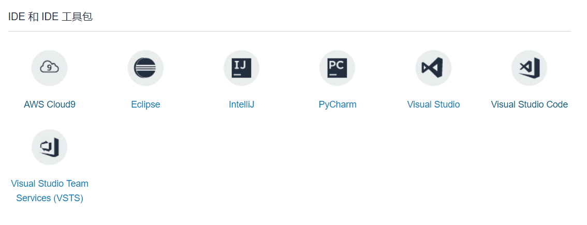

# AWS Cloud9
AWS Cloud9 是一种基于云的集成开发环境 (IDE)，借助它，您可以从任何计算机，只需一个浏览器即可编写、运行和调试代码。Cloud9 IDE 提供动态编程语言 (包括 JavaScript、Python、PHP、Ruby、Go 和 C++) 所需的软件和工具。这意味着您不必再花时间安装程序或配置您的开发计算机。当您在托管的 EC2 实例上运行 Cloud9 开发环境时，可以获得完整的 sudo 特权和预先进行身份验证的 AWS CLI。Cloud9 还集成了 AWS CodeStar，可为您提供所需的工具以便将应用程序成功部署到 AWS。

Cloud9支持的语言和级别。

## 优势
#### 功能齐全的编辑器
AWS Cloud9 提供一个基于浏览器的编辑器，您可以使用它轻松地编写、运行和调试您的项目。键入时，编辑器中会显示代码完成度和代码提示建议，以帮助您快速编码和避免错误。代码完成度不仅基于文件内的标识符，还基于标准库。借助编辑器，您还能够完全自定义您的视图。您可以使用简单的拖放操作，将面板调整到任何方向。
#### 运行配置的广泛选择
AWS Cloud9 支持 40 多种编程语言和应用程序类型，包括 JavaScript、Python、PHP、Ruby、Go 和 C++。借助 Cloud9，您可以通过指定环境变量、文件名、命令行选项等，选择默认运行配置或定义自定义配置。
#### 集成调试器
AWS Cloud9 配备一个集成调试器，此调试器可提供一些常用的功能，例如设置断点、单步调试代码和检查任意 PHP、Python、JS/Node.js、C/C++ 应用程序的变量。
#### 无服务器开发的集成工具
AWS Cloud9 提供从开始使用到编写和调试无服务器应用程序代码的完整体验，使您能够轻松构建无服务器应用程序。The Cloud9 开发环境预装了无服务器应用程序开发所需的软件开发工具包、各种工具和库。Cloud9 还支持无服务器应用程序模型 (SAM)，因此您能够在 Cloud9 中使用 SAM 模板，以提供一种简化的方法来定义无服务器应用程序的资源。此外，Cloud9 允许您在本地编辑和调试 AWS Lambda 函数，无需将您的代码上传到 Lambda 控制台进行调试。
#### 与任何 Linux 服务器平台的连接
您可以灵活选择在托管的 Amazon EC2 Linux 实例上或在您目前正使用的任何 Linux 服务器上运行 AWS Cloud9 开发环境。连接到可以在任何位置 (包括 AWS、本地或任何其他云提供商) 运行的您自己的 Linux 服务器时，您只能在 Cloud9 设置期间选择 SSH 连接选项。
#### 内置终端
AWS Cloud9 提供一种终端，它拥有您的托管 Amazon EC2 实例的完整 sudo 特权。您可以借助它运行各种命令，例如将代码更改推送到 git、编译您的代码或显示您的服务器的命令输出。您的终端安装了预先进行身份验证的 AWS 命令行界面，使您能够直接从命令行轻松控制 AWS 服务并与之交互
#### 协同编辑和聊天
借助 AWS Cloud9，您能够与团队共享您的开发环境。这让您团队中的多名开发人员能够轻松、主动地在同一文件中查看对方的类型和结对程序。Cloud9 使您能够使用内置聊天功能来与团队通信，无需离开 IDE。
#### 持续交付工具链
AWS Cloud9 与 AWS CodeStar 集成，从而使您能够为您的应用程序快速设置端到端持续交付工具链并更快地开始在 AWS 上发布代码。Codestar 提供统一体验，使您能够在 AWS CodeCommit、AWS CodeBuild、AWS CodePipeline 和 AWS CodeDeploy 的帮助下轻松构建、测试应用程序并将其部署到 AWS。只需单击几下即可将您的 Cloud9 开发环境连接到持续交付工具链。
#### 文件修订历史记录
AWS Cloud9 会将文件的修订历史记录保存在您的开发环境中。这使您能够快速了解之前所做的代码更改，以及恢复至早期的迭代。
#### 主题
AWS Cloud9 为您提供多种控制语法高亮显示和 UI 的颜色方案选项。您还可以通过编辑样式表完全自定义 Cloud9 UI。
#### 键盘快捷键
除了默认密钥绑定，AWS Cloud9 还提供使用 VIM、Emacs 和 Sublime 密钥绑定的选项，您也可以自定义绑定。这使得您能够使用您已熟悉的命令和快捷键。
#### 内置图像编辑器
AWS Cloud9 支持图像编辑功能，使您能够直接从浏览器中调整图像大小以及裁剪、旋转或翻转图像。
## 体验
目前AWS支持的IDE如下图
